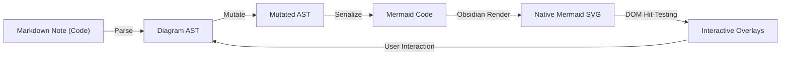

# Merlay — Architecture & Engineering Guide

This document provides a comprehensive technical overview of the architecture of **Merlay (`merlay`)**. It is designed specifically to help human contributors and AI coding assistants understand the system's core principles, component responsibilities, file organization, and extension patterns.

---

## 1. Core Architecture Philosophy

Mermaid is a declarative, code-first diagramming language. It calculates layout automatically using graph layout algorithms (dagre, elk, or d3). Traditional visual editors attempt to impose absolute pixel coordinates onto diagrams, causing layout conflicts, syntax degradation, and synchronization nightmares.

**Merlay** adopts a **structural, non-spatial architecture**:
1. **Source of Truth**: The Mermaid syntax string in the Markdown document is always the single source of truth.
2. **Pure AST Operations**: User actions (sprout, connect, rename, delete, style) mutate an in-memory Abstract Syntax Tree (AST), which serializes back to clean, standard Mermaid code.
3. **100% Native Obsidian Rendering**: Code is passed directly to Obsidian's native Mermaid renderer. No custom layout engines or canvas libraries (React Flow, Elk) are used.
4. **Interactive Direct-Manipulation Overlays**: Lightweight SVG/HTML overlays (selection halos, sprout buttons, drag-to-connect handles, floating HUDs, and inline text inputs) track the bounding boxes of rendered SVG elements without interfering with diagram layout.
5. **Camera Stabilization**: Viewport tracking pins active nodes across re-renders to eliminate jarring view jumps.



---

## 2. Directory Structure & Module Map

The codebase is organized into modular, decoupled single-responsibility units:

```
src/
├── main.ts                     # Obsidian Plugin lifecycle entrypoint (clean, lightweight coordinator)
├── diagrams/                   # Pluggable multi-diagram driver system
│   ├── types.ts                # DiagramDriver contract: capabilities, labels, mutation surface,
│   │                           # view projection, anchor API, SVG DOM adapter, registry types
│   ├── viewModel.ts            # Shared canvas view-model (MermaidNodeDef, MermaidEdgeDef,
│   │                           # MermaidSubgraphDef, shapes, arrows, directions) — every driver
│   │                           # projects onto these; the canvas never sees a native AST
│   ├── registry.ts             # Driver registry + diagram detection + default templates
│   ├── nodeLinks.ts            # Node link extraction and Obsidian note navigation
│   ├── common/                 # Shared plumbing across all diagram types
│   │   ├── diagramHeader.ts    # splitFrontmatter, emitFrontmatter, theme helpers, unique ID generation
│   │   └── index.ts            # Barrel export
│   └── <diagramPackage>/       # Pluggable diagram packages (e.g. flowchart, state, sequence, mindmap, ...)
│       ├── types.ts            # Diagram AST definitions & domain-specific tokens
│       ├── lexer.ts            # Tokenizer for diagram syntax
│       ├── parser.ts           # Code -> AST parser (uses splitFrontmatter from common/)
│       ├── serializer.ts       # AST -> clean standard Mermaid code
│       ├── <name>Driver.ts     # DiagramDriver<T> implementation
│       └── mutations/          # Pure AST mutations (<300 LOC each)
│           ├── nodeMutations.ts      # Add, sprout, rename, delete nodes/elements
│           ├── edgeMutations.ts      # Connect, relabel, reverse, delete connections
│           ├── clipboardMutations.ts # Duplicate, copy, paste elements
│           └── index.ts              # Barrel export
├── obsidian/                   # Obsidian API adapters (decoupled from UI)
│   ├── buttonInjector.ts       # Injects "Visual Mode" button beside Obsidian's edit button
│   ├── workspaceObserver.ts    # Monitors workspace leaves, preview mutations, and active file
│   └── diagramOpener.ts        # Coordinates opening diagrams in modal or file tabs
├── canvas/                     # Interactive visual canvas & overlays (driver-agnostic)
│   ├── NativeMermaidView.tsx   # Primary React canvas coordinator component
│   ├── types.ts                # Viewport, camera, selection, and overlay types
│   ├── constants.ts            # Preset color themes and edge styles
│   ├── historyManager.ts       # Undo/redo stack and snapshot management
│   ├── store/                  # Centralized canvas state store (Zustand)
│   │   └── canvasStore.ts      # Single source for camera, selection, drag, and HUD UI state
│   ├── components/             # Reusable canvas UI components
│   │   ├── CanvasTopBar.tsx    # Direction toggle, cursor mode, theme selector, undo/redo
│   │   ├── CanvasOverlays.tsx  # Composed overlay container delegating to overlay layers
│   │   ├── NodeActionHud.tsx   # Sprout, kind, color, delete floating HUD
│   │   ├── EdgeActionHud.tsx   # Edge type, reverse, label, delete HUD
│   │   ├── SubgraphActionHud.tsx # Subgraph rename, style, dissolve HUD
│   │   ├── MultiSelectHud.tsx  # Multi-element batch action HUD
│   │   ├── KindPopover.tsx     # Generic node-kind picker (shapes, stereotypes, etc.)
│   │   ├── ThemePopover.tsx    # Universal diagram theme selector (Default, Dark, Forest, etc.)
│   │   └── SyntaxDrawer.tsx    # Slide-out live Mermaid code drawer
│   ├── overlays/               # Focused overlay rendering layers (<180 LOC each)
│   │   ├── NodeOverlays.tsx    # Selected node halo, sprout button, popovers
│   │   ├── EdgeOverlays.tsx    # Edge selection halo and action HUD
│   │   ├── SubgraphOverlays.tsx# Subgraph cluster selection, borders, actions
│   │   ├── MultiSelectOverlays.tsx # Multi-selection bounding box & batch actions
│   │   └── InlineEditOverlays.tsx  # Direct text editing inputs for nodes/edges/subgraphs
│   ├── interaction/            # SVG DOM hit-testing & event setup (driver DOM adapter)
│   │   ├── setupSvgInteractivity.ts      # Orchestrator for SVG DOM listeners
│   │   ├── setupViewOnlyInteractivity.ts # View-only mode element selection & inspection
│   │   ├── nodeInteractivity.ts          # Node selection, hover, start/end anchors
│   │   ├── edgeInteractivity.ts          # Edge hit-testing and hovering
│   │   ├── clusterInteractivity.ts       # Subgraph cluster selection & dblclick
│   │   └── touchGestures.ts              # Pinch-zoom, touch pan, tap & long-press
│   ├── renderer/               # SVG rendering & selection styling
│   │   ├── mermaidRenderer.ts  # Obsidian native mermaid.render wrapper & sanitization
│   │   └── selectionHalo.ts    # SVG halo styling for active nodes and edges
│   └── hooks/                  # Granular canvas state hooks (driver-dispatched)
│       ├── useCanvasCamera.ts  # Pan, zoom, wheel, fit-view, pinNodeForCamera
│       ├── useCanvasSelection.ts # Selection state (single, multi, subgraphs)
│       ├── useMarqueeSelection.ts # Drag-to-select box calculation
│       ├── useInlineEditing.ts # Inline text edit state and commit handlers
│       ├── useCanvasShortcuts.ts # Keyboard shortcuts (Del, Ctrl+Z, Ctrl+C/V, Space)
│       ├── useCanvasMouseInteractions.ts # Pan, drag-to-connect line, hover tracking
│       ├── useCanvasRenderer.ts# SVG rendering effect, camera stabilization, unmatched subgraphs
│       ├── useDiagramMutations.ts # Composed diagram mutation coordinator
│       └── mutations/          # Modular mutation sub-hooks (<300 LOC each)
│           ├── useDiagramAst.ts        # Single active AST, driver projections, applyMutation
│           ├── useNodeMutations.ts     # Sprouting, kind changes, node deletion
│           ├── useEdgeMutations.ts     # Connecting, edge reversal, edge deletion
│           ├── useSubgraphMutations.ts # Group creation, renaming, dissolve
│           ├── useBatchMutations.ts    # Multi-node batch operations
│           └── useClipboardMutations.ts# Copy, paste, duplicate
└── utils/                      # Helper algorithms
    ├── markdownBlock.ts        # Scans and updates ```mermaid fences in markdown notes
    ├── edgeMatching.ts         # Fuzzy maps SVG <path> elements to view-model edge definitions
    └── edgeGeometry.ts         # Math for SVG bezier path hit distance
```

---

## 3. Engineering Rules & Universal Driver Architecture

### 3.1 Domain Cohesion & State Architecture
- Prefer **cohesive, decoupled modules** over arbitrary line-count file chopping.
- Centralize shared canvas state (selection, geometry, camera, active popovers) in the Zustand store (`src/canvas/store/canvasStore.ts`) to eliminate prop-threading and ref-mirroring.
- Always maintain facade re-exports (`index.ts`) when refactoring code to preserve backward compatibility with tests and callers.

### 3.2 Pure AST Mutations
- **NEVER** modify SVG DOM nodes directly to update diagram structure.
- All structural edits (add, sprout, connect, rename, delete) follow a strict unidirectional cycle:
  `clone(ast)` → `mutate(clone)` → `serialize(clone)` → `verify syntax` → `emit`.
- External code changes (undo/redo, manual edits in the syntax drawer) re-parse through an effect. There is always **one active AST** owned by the current driver in `useDiagramAst`.

### 3.3 Camera Stabilization (Prevent Viewport Jumps)
- Whenever a user triggers a structural modification (such as sprouting a new element or splitting a connection), call `pinNodeForCamera(activeNodeId)`.
- The camera tracks that element's screen coordinate before and after re-rendering and automatically adjusts the pan offset so the viewport remains stable.

### 3.4 Zero Lock-In & Verbatim Preservation
- Emitted Mermaid code must be **100% clean, standard Mermaid syntax**.
- Never inject synthetic comments or proprietary layout metadata (e.g. `%% mv: x=... %%`).
- **Verbatim Preservation (`rawLines`)**: Real-world diagrams frequently contain statements or directives not directly modeled by visual editing tools (e.g., notes, styling classes, click events, accessibility directives, comments). Every driver parser must preserve unmodeled lines in `ast.rawLines` and re-emit them verbatim during serialization. A visual edit must never corrupt or discard hand-written code.

### 3.5 Universal Driver Pattern (Pluggable Diagram System)
The canvas layer has **zero hardcoded knowledge of any specific diagram type**. It interacts exclusively with the polymorphic `DiagramDriver<T>` interface (`src/diagrams/types.ts`).

Every diagram package satisfies the same core contract:

1. **Round-Trip Parsing & Serialization**:
   - `parse(code)` / `serialize(ast)`: Bidirectional conversion between raw Mermaid code and native AST.
   - `createDefault()` / `createEmpty()` / `clone(ast)`: Template generation and safe AST cloning.
2. **Read-Only View Projection (`project`)**:
   - The driver maps its domain AST onto the unified view-model: `MermaidNodeDef`, `MermaidEdgeDef`, and `MermaidSubgraphDef`.
   - The canvas and overlays render strictly against this projected model. The canvas never mutates projection objects directly; all modifications route through `driver.mutations`.
3. **Capability-Gated UI (`capabilities`)**:
   - Different diagrams support different features. A driver declares its feature support via `driver.capabilities` (e.g., `supportsNodeStyles`, `supportsEdgeTypes`, `hasAnchors`, `supportsSubgraphs`, `supportsDirection`).
   - Canvas HUDs, popovers, sprout handles, and menus automatically show or hide controls based on these capabilities. If a diagram does not support edge styles or subgraphs, those UI elements are automatically omitted.
4. **Domain-Specific Vocabulary (`labels`)**:
   - The UI never hard-codes diagram-specific nouns. The driver provides its domain terminology via `driver.labels` (e.g., node noun: "Step", "State", or "Topic"; edge noun: "Arrow", "Transition", or "Branch").
5. **SVG DOM Adapter (`dom`)**:
   - Mermaid renders different diagram types with different SVG element structures and ID conventions. The driver's `dom` adapter defines how to find SVG elements by node ID, resolve start/end anchors, and locate element bounding boxes.
6. **Centralized Header & Theme Plumbing**:
   - All diagram parsers and serializers delegate frontmatter extraction, header detection, and theme configuration to `src/diagrams/common/diagramHeader.ts`.
   - Themes (`default`, `neutral`, `forest`, `dark`, `base`, `auto`) operate universally across all diagrams via standard Mermaid YAML frontmatter (`--- config: { theme: ... } ---`).

---

## 4. Verification & Testing

Every PR and change must maintain strict correctness:

```bash
# Run all unit, integration, and compliance tests (385+ passing tests)
npm test

# Run TypeScript type check and production esbuild bundle
npm run build
```

### Testing Invariants:
- **Parse-Mutate-Serialize Round-Trip**: Every mutation must be covered by unit tests proving clean round-trip serialization.
- **Verbatim Preservation**: Real-world diagrams with comments, notes, class definitions, and custom directives must survive visual edits without losing user code.
- **Driver Surface Contract**: Every new diagram driver must pass the polymorphic contract suite (see `tests/driverSurface.test.ts`).
- **Obsidian Review Compliance**: Statically checkable Obsidian review rules are enforced by `tests/obsidianCompliance.test.ts`.

---

## 5. Adding a New Diagram Type

For the complete, 5-phase step-by-step engineering and UX procedure (including grammar analysis, UX coherence, error prevention, preservation rules, and an AI execution prompt template), see the dedicated playbook:

👉 **[docs/ADDING_NEW_DIAGRAM.md](docs/ADDING_NEW_DIAGRAM.md)**

### Quick Summary:
1. **Scaffold Package**: Create `src/diagrams/<name>/` following the canonical driver layout.
2. **Define AST & Types**: In `types.ts`.
3. **Implement Lexer & Parser**: In `lexer.ts` and `parser.ts` (using `splitFrontmatter` from `common/`).
4. **Implement Serializer**: In `serializer.ts` (using `emitFrontmatter`).
5. **Implement Mutations**: In `mutations/`, wiring into `DiagramMutations`.
6. **Implement Driver**: In `<name>Driver.ts` implementing `DiagramDriver<T>`.
7. **Register Driver**: In `src/diagrams/registry.ts` and add template.
8. **Verify**: Add unit tests under `tests/<name>.test.ts` and verify with `npm test`.

**No canvas, hook, overlay, or component files need to change** — if they do, the driver contract has a gap that should be generalized in `src/diagrams/types.ts` instead.
